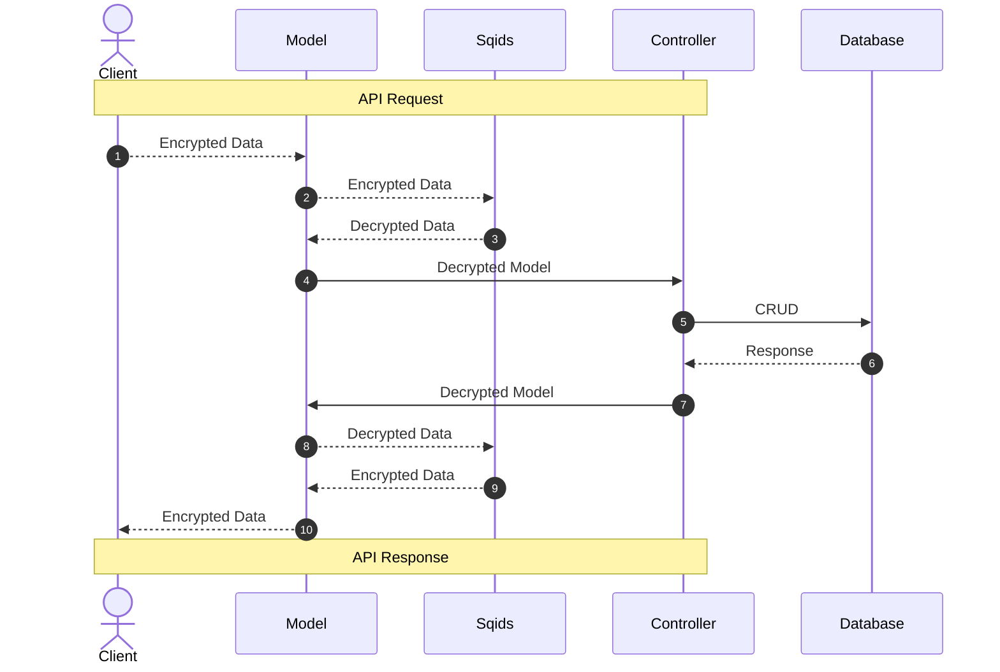

# Sqids Example

[Sqids](https://github.com/sqids/sqids-dotnet) is a library that enables you to generate YouTube-like identifiers (e.g., “123” -> “yc3”, “yc3” -> “123”) and provides value encoding/decoding capabilities.

In databases, two common methods are widely used for identity verification and data association: UUIDs (Universally Unique Identifiers) and auto-increment IDs. Each method has its own set of advantages and disadvantages.

UUIDs are universally unique identifiers that are mostly generated randomly. This feature makes UUIDs particularly ideal for distributed systems because the likelihood of collision is extremely low. However, the length and random structure of UUIDs can negatively affect readability for humans and database performance.

On the other hand, auto-increment IDs show a sequential and predictable increase. This facilitates readability for humans and is efficient for database indexing. However, this predictability can pose a security risk. Especially in web applications, the predictability of sequential IDs can allow malicious users unauthorized access to database records.

In this project, Sqids aims to improve the readability for humans and database performance while maintaining the uniqueness advantage offered by UUIDs, by addressing the security vulnerability of auto-increment IDs. This example securely exposes encrypted IDs to the outside world and decrypts incoming encrypted IDs for use within the application.

This approach provides an additional layer of security against malicious access attempts and enhances the security of database records. At the same time, it offers a solution suitable for the needs of modern web applications by facilitating system integration and data exchange.




## Application Settings

You can change the relevant fields in the `appsettings.json` file. Passwords will be generated using the characters in the `Alphabet` field. To shuffle the characters, you can use the [shuffle-letters](https://codebeautify.org/shuffle-letters) tool. For detailed information [Sqids](https://github.com/sqids/sqids-dotnet).

```json
 "Sqids": {
    "Alphabet": "ABCDEFGHIJKLMNOPQRSTUVWXYZabcdefghijklmnopqrstuvwxyz0123456789",
    "MinLength": 6,
    "BlockList": [
      "1di0t",
      "1diot"
    ]
  }
